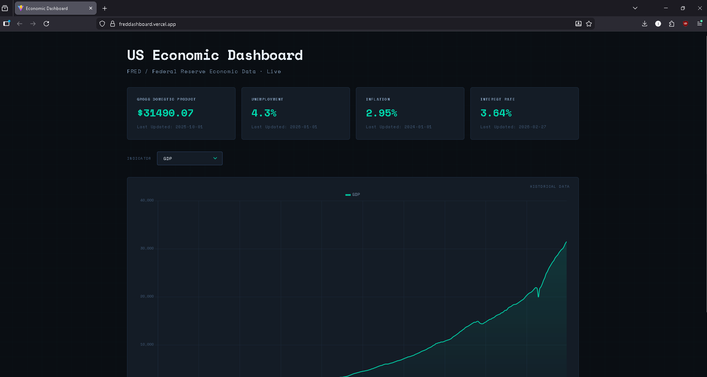

# FRED Economic Dashboard

## Project Introduction

### What is this project?
A full-stack economic data dashboard that pulls live data from the Federal Reserve Economic Data (FRED) API and visualizes key U.S. economic indicators in one clean, interactive interface.

### Why was it built?
Tracking economic trends typically requires jumping between multiple government and financial websites. This dashboard centralizes GDP growth, inflation (CPI), interest rates, and employment data into a single view — making it easy to monitor and compare indicators at a glance.

### Who is it for?
Built as a personal portfolio project to demonstrate full-stack development skills using real-world financial data. A useful reference tool for anyone curious about current U.S. macroeconomic conditions.

---

## Deployment & Demo

**Live Deployment:** [https://freddashboard.vercel.app](https://freddashboard.vercel.app)

- **Project Screenshots:**
  - 

---

## Tech Stack

**Frontend:**
- React (Vite)
- Chart.js / react-chartjs-2
- CSS

**Backend:**
- Node.js
- Express

**APIs:**
- [FRED API](https://fred.stlouisfed.org/docs/api/fred/) — Federal Reserve Economic Data

**Additional Libraries:**
- Axios — HTTP requests to FRED API
- dotenv — Environment variable management
- cors — Cross-origin resource sharing
- react-icons — Social/footer icons

**Development Tools:**
- Git & GitHub
- npm
- VS Code

---

## Project Setup Instructions

### Prerequisites
- Node.js v16+
- A free [FRED API key](https://fred.stlouisfed.org/docs/api/api_key.html)

### Installation Steps

This is a monorepo with separate `client/` and `server/` folders, each with their own `package.json`.

1. **Clone the repository:**
   ```bash
   git clone https://github.com/ishtiaqa1/Fred-DashBoard
   cd Fred-DashBoard
   ```

2. **Install backend dependencies:**
   ```bash
   cd server
   npm install
   ```

3. **Install frontend dependencies:**
   ```bash
   cd ../client
   npm install
   ```

4. **Backend environment setup:**
   ```bash
   cd ../server
   cp .env.example .env
   ```
   Add the following to `server/.env`:
   ```
   FRED_API_KEY=your_api_key_here
   ```

5. **Frontend environment setup:**

   Create `client/.env.development`:
   ```
   VITE_API_URL=http://localhost:3001
   ```

6. **Start the backend server:**
   ```bash
   cd server
   npm start
   ```

7. **Start the frontend (in a separate terminal):**
   ```bash
   cd client
   npm run dev
   ```

8. **Access the application:**
   Open your browser and navigate to `http://localhost:5173`

---

## Contributing

We welcome contributions! Please follow these guidelines:

### How to Contribute

1. Fork the repository
2. Create a feature branch: `git checkout -b feature/your-feature-name`
3. Make your changes following our coding standards
4. Write or update tests as needed
5. Commit your changes with descriptive commit messages
6. Push to your branch: `git push origin feature/your-feature-name`
7. Submit a pull request with a clear description of your changes

### Contribution Guidelines

- Follow the existing code style and conventions
- Write clear, descriptive commit messages
- Include tests for new functionality
- Update documentation as needed
- Ensure all tests pass before submitting PR

### Development Workflow

- Never push code directly to the `main` branch
- Work on separate feature branches
- Create pull requests (PRs) for all changes
- All PRs must be reviewed and merged by someone else, even on solo projects
- Delete branches after successful merges

### Branch Naming Convention

- `feature/feature-name` — new features
- `fix/bug-description` — bug fixes
- `update/component-name` — updates to existing functionality
- `style/styling-changes` — styling updates

---

## Documentation Standards

### Inline Comments
- Document code with clear, concise comments
- Label different parts of the code
- Describe what functions and files are for
- Delete any commented-out code before committing

### Commit Message Format

| Prefix | Use for |
|--------|---------|
| `feat:` | New features |
| `fix:` | Bug fixes |
| `update:` | Updates to existing functionality |
| `style:` | Styling changes |
| `delete:` | Removing code/files |

**Examples:**
```
feat: add social footer with GitHub and LinkedIn links
fix: resolve CORS mismatch between Vercel and Render
update: improve error handling with retry logic
style: redesign dashboard with terminal aesthetic
delete: remove unused Exchange component placeholders
```

---

## Project Management

### Scrum Board
- Maintain an updated and detailed scrum board
- Use specific, descriptive cards for all tasks
- Track progress through stages: To Do → In Progress → Review → Done

### Pull Request Guidelines

All PRs should include:
- Descriptive titles that summarize the changes
- Detailed descriptions covering features added, bug fixes, testing results, and any breaking changes
- Screenshots for UI changes

**PR Description Template:**
```markdown
## What this PR does
[Brief description of changes]

## Features Added/Modified
- [List of new features or modifications]

## Testing
- [ ] All tests pass
- [ ] Manually tested functionality
- [ ] No breaking changes

## Screenshots (if applicable)
[Add screenshots of UI changes]
```

---

## Contact

[Github](https://github.com/ishtiaqa1)